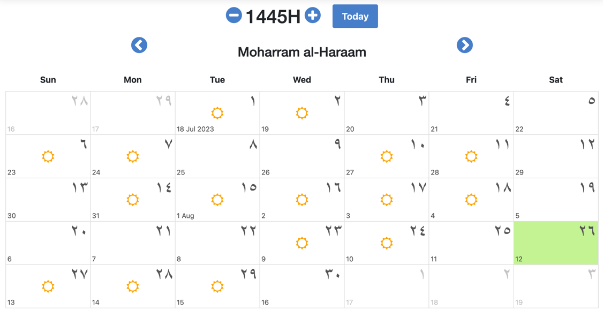

# Mumineen UI Plugins

## Introduction

Mumineen UI Plugins is a react library which features some of the commonly used UI plugins
for [Dawoodi Bohra Shia Muslims] who follow the 53rd Dai al-Mutlaq, His Holiness, [Syedna Aale Qadr Mufaddal
Saifuddin] (_TUS_).

## Installation
```shell
npm install mumineen-ui-plugins
```
or
```shell
yarn add mumineen-ui-plugins
```

This package only contains one UI plugin which is the [Hijri Calendar] but there will be more plugins added in the future.

## Hijri Calendar
### Usage
```typescript
import { HijriCalendar } from 'mumineen-ui-plugins';

const App = () => {
  return (
    <HijriCalendar />
  );
}
```

### Props
| Name | Type       | Default     | Description                                                            |
| --- |------------|-------------|------------------------------------------------------------------------|
| `miqaats` | `MiqaatMonth[]` | `[]`        | List of miqaats to be displayed on the calendar.                       |
| `additionalDayContent` | `(day: Day) => React.ReactNode` | `undefined` | Callback function to return additional content in the modal for a day. |
| `onDayClick` | `(day: Day) => void` | `undefined` | Callback function to be called when a day is clicked.                  |
| `showDefaultMiqaatData` | `boolean` | `false`      | Whether to show the default miqaat data (embedded in library).         |

## License

This software is released under the terms and conditions of [The MIT License].
Please see the `LICENSE.txt` file for more details.

[The MIT License]: http://www.opensource.org/licenses/mit-license.php
[Dawoodi Bohra Shia Muslims]: https://www.thedawoodibohras.com/
[Gregorian date]: http://en.wikipedia.org/wiki/Gregorian_calendar
[Hijri Calendar]: http://en.wikipedia.org/wiki/Islamic_calendar
[Middleman]: http://middlemanapp.com/
[React]: http://facebook.github.io/react/
[Ruby on Rails version]: https://github.com/mygulamali/mumineen_calendar
[Syedna Aale Qadr Mufaddal Saifuddin]: https://www.thedawoodibohras.com/about-the-bohras/the-dai-al-mutlaq/53rd-dai-al-mutlaq/
